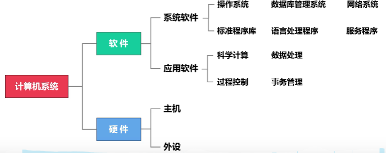
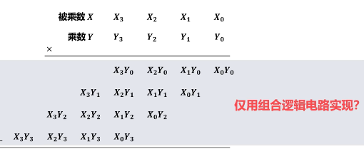
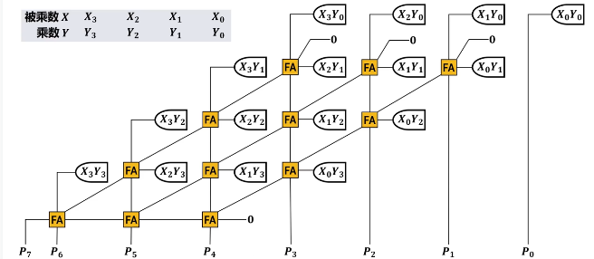
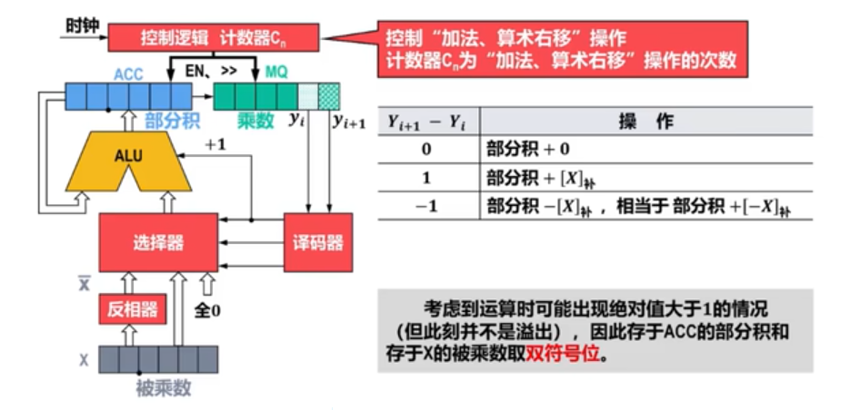
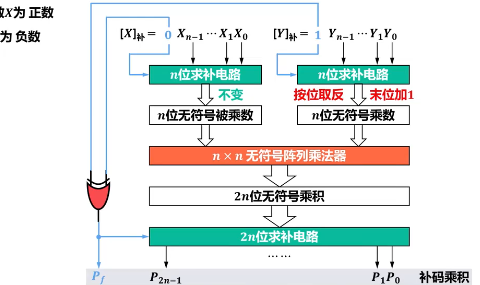

[toc]

# 计算机组成原理

## **第一章 计算机系统概述：**

### 1.计算机系统的组成：

常见的软件分类有：

1. 系统软件：操作系统、数据库管理系统DBMS、标准程序库、网络软件系统、语言处理程序
2. 服务性程序、编译程序、连接程序、分布式软件系统
3. 应用软件：微信、QQ、数据库软件DBS

- 一般来说，软件的功能和硬件的功能是可以相互替代的，硬件效率高，实现复杂，软件简单但效率低

### 2.计算机系统的发展：

### 3.计算机硬件组成：

上图为冯诺伊曼结构：以**运算器为中心（运算器负载高，压力大）**

特点：①计算机硬件系统由五大部件组成
	 ②**指令和数据都是以同等地位存于存储器，可按地址寻访，指令是顺序执行的**
	③指令和数据用二进制表示
	④指令由操作码和地址码组成 
	⑤**采用"存储程序"的工作方式**

冯氏结构的设计主要是以一种**控制流驱动的工作方式**进行的，即我给你把步骤安排好了，只需要按照这个控制流程走下去就行。

现代计算机则优化了这一结构，以存储器为中心

功能简介：

- ALU:用于算数运算和逻辑运算
- 主存储器：与cpu直接交换信息（交换信息有媒介的，不要搞混了 **内存—>cache—>寄存器**）
- 外部设备：输入输出设备，将输入内容转化为计算机所知道的，同时输出时将二进制转化为人所知道的。

### 4.计算机软件：

注意数据库这种特殊的系统软件，以及编译器，解释器这种用于程序翻译的系统软件。

程序在系统中被转化的流程：

整个过程经过了：

1. 预处理：将c文件中的一些注释等其他东西进行删除，同时进行宏替换，把一些头文件内容复制进来等一系列操作。
2. 编译：将c语言转化为汇编语言（**根据ISA架构转化为相应的汇编内容**，arm转arm的汇编，x86转x86的汇编）
3. 汇编：将汇编语言转换为机器可执行的二进制代码
4. 链接：将多个二进制代码模块串起来，形成一个完整的可执行文件。

详细的程序内存分配以及地址映射见程序装载部分（OS)

### 5.计算机系统的结构层次

**分层原因：**计算机是一个非常复杂的系统，为了**简化对计算机系统的研究和实现**，可以采用分层思想将计算机划分成多个层次的系统。

同计算机网络分层效果，**下一层为上一层提供一个简洁抽象的接口，屏蔽了内部实现过程。是透明的。**

各大分层都没有明确规定，这里给出了一个分层参考方案：

注意这里的考题，容易问你，哪类程序员在哪一层（也就是他应该知道哪一层的内容，而对其他层的内容不了解），**在 CPU 的寄存器中，指令寄存器对用户是完全透明的** 。

### 6.计算机的工作原理

接上文的内容，我们这次来详细讲讲各个硬件的详细组成：

#### 1.运算器:

1. 构成：ALU ，ACC(累加寄存器)， MQ乘商寄存器,  X操作数寄存器， PSW状态寄存器，移位器、计数器、变址寄存器IX、基址寄存器BR （后面这几个到寻址部分再来讲述）

   算术逻辑单元ALU：
   通过内部复杂的电路实现**算数运算、逻辑运算**

   累加寄存器ACC：
   用于**存放操作数，或运算结果**

   乘商寄存器MQ：
   在乘、除运算时 ，用于存放操作数或运算结果

   操作数寄存器X：
   用于存放操作数 

   **状态寄存器PSW：**
   存放ALU运算得到的一些标志信息或处理机的状态信息，OF, ZF ,SF, CF

以图表的形式展示如下：

#### 2.控制器：

1. 构成：CU、IR、PC、指令译码器(地址译码器在内存中)、时序系统、微操作信号发生器(后面几个涉及到数据寻址以及cpu构成的时候再来讨论)

2. 工作原理：

   控制单元 CU：分析指令，给出控制信号 

   指令寄存器 IR：存放当前执行的指令 **(IR中的内容来源于主存的MDR)**

   程序计数器 PC：存放下一条指令地址，有**自动加一**功能**（PC与主存的MAR之间有一 条直接通路）**

3. 注意事项：

   CPU 区分指令和数据的依据：1.指令周期的不同阶段（**在取指令阶段取出的为指令、在 执行指令阶段取出的即为数据**）2.通过地址来源区分 （**由PC提供存储单元地址取出的是指令、由指令地址码部分提供存储单元地址取出的是操作数**）

#### 3.存储器：

1. 构成：存储体、MAR,MDR（现代计算机为了加速计算，将这俩都放在cpu中）

2. 工作原理：存放二进制信息。 

   存储单元——每个存储单元存放一串二进制代码   存储字——存储单元中二进制代码的组合

    存储字长——存储单元中二进制代码的位数

    存储元——存储二进制的电子元件，每个存储元可存1bit MAR ： 存放访存地址，经过地址译码后找到所选的存储单元。 MAR位数反应存储单元的个数 【 MAR=4 位 ——> 总共有 24 个存储单元】 MDR ： 用于暂存要从存储器中读或写的信息。 =16bit 】 MDR位数=存储字长 【 MDR=16 位 ——> 每个存储单元可存放 16bit ，一个字 一个字节 =8bit ， 1B= 一个字节， 1b=1bit ，字由计算机硬件决定 。 时序控制逻辑：用于产生存储器操作所需的各种时序信号。

#### 4.工作过程：

7

### 7.计算机性能指标：

#### 1.机器字长：

字长：CPU内部用于整数运算的数据通路的宽度。（字长=CPU内部用于整数运算的运算 器位数=通用寄存器宽度） 

字：表示被处理信息的单位。不同机器的字的位数可能不同。 

机器字长：**计算机进行一次整数运算所能处理的二进制的位数**。 

指令字长：一个指令中二进制的位数 

存储字长：存储单元中二进制的位数(MDR)。指令字长一般为存储字长的整数倍。

#### 2.数据通路带宽：

hint: 这里的带宽是指的外部数据总线的宽度。而不是cpu内部总线的

数据通路带宽——**数据总线一次所能并行传送信息的位数**。

#### 3.主存容量：

$容量 = 存储单元个数 * 存储字长 （bit） = 存储单元个数 * 存储字长 / 8 （Byte）$

e. g   $MAR为32位，MDR为8位，总容量=232 * 8bit = 4GB$

#### 4.运算速度：

##### 1.吞吐量：

系统在单位时间内处理请求的数量，主要取决于主存的存取周期

##### 2.响应时间：

与操作系统中介绍的响应时间类似，**用户发出请求时间，到该请求被处理完的等待时间**

##### 3.cpu时钟周期：

每个脉冲信号的时间称为CPU时钟周期。**CPU工作的最小时间单位。**

##### 4.CPI:

定义：**执行一条指令所需要的时钟周期数量**。

注意一条指令的cpi和一类指令的cpi。一个通过测试得到，另一个是要加权平均的。

##### 5.cpu执行时间：

是cpu真正用于执行用户程序的执行时间。

定义为  $ cpu执行时间 = 程序执行所需要的时钟周期数量 * 时钟周期$

通常这里容易结合cpi来考，可参考下面例题。

##### 6.IPC

每个时钟周期能够执行的指令数量。

由定义可知，cpi的倒数就是ipc，由于现在的流水线技术的发展，现在的ipc值已经可以大于1了。

##### 7.MIPS

每秒执行多少百万条指令。

比较方式有点不准确，因为有些机器的架构和指令集设置不同，导致每台机器处理指令的速度不同。

##### 8.MFLOPS

每秒执行多少百万次浮点运算。

能够反映浮点计算能力，但是不能反映整体性能。

tip：注意这里的单位换算。

**在描述文件大小、存储容量的时候，K、M、G、T通常认为是2的次方** 

**在描述速率、频率的时候，K、M、G、T通常认为是10的次方**

### 8.几个专业术语

系列机：具有**基本相同的体系结构**，使用相同基本指令系统的多个不同型号的计算机组 成的一个产品系列。 

兼容：指软件或硬件的通用性，即运行在某个型号的计算机系统中的硬件/软件也能应 用于另一个型号的计算机系统时，称这两台计算机在硬件或软件上存在兼容性。 

软件可移植性：把使用在某个系列计算机中的软件直接或进行很少的修改就能运行在另 一个系列计算机中的可能性。 

固件：将程序固化在ROM中组成的部件。（**固件是具有软件特性的硬件，例如bios**）（执行速度 快于软件、灵活性快于硬件）

## **第二章 ： 数据的表示**

### 1.进制转换

基数： 每个数码位所用到的不同符号的个数，r进制的基数为r 。

二进制转十进制：101.1——>$1 * 2^2 + 0 * 2^1 + 1*2^1 + 1 * 2^{-1} = 5.5$ 

八进制转十进制：5.4——>5 * 80 + 4 * 8-1 = 5.5 

十六进制转十进制：5.8——> 5 * 160 + 8 * 16-1 = 5.5

**方法：整数部分直接除以基数取余，最后将余数结果倒着排列一遍，小数部分就直接乘以基数，如果得到的结果中，出现了整数部分为1，那么就写1，同时直接将整数位变为0，这样依次进行下去，直到结果为0，或者达到一定精度。**

### 2.定点数的编码表示

#### 1.真值和机器数

- 真值：符合人类习惯的数字，计算机所代表的实际值。 
- 机器数：数字实际存到机器里的形式，正负号需要被“数字化”。

#### 2.机器数的定点表示

对于数据来说，有两种形式，一种整数，一种是小数。那么计算机来如何保存呢？

整数就用定点整数表示就好了，像小数，我们可以将其变成（定点整数+阶码），以浮点数的形式表示。

   定点表示法用来表示定点小数和定点整数。 

（1）定点小数：**定点小数是纯小数，即无整数部分**。小数点位置在符号位之后，最高有 效位之前。 

（2）定点整数：**定点整数是纯整数。小数点位置在最后**。

### 3.原码，补码，移码，反码表示法：

#### 1.介绍：

 **原码**：由符号位和数值位组成，正数：  符号位为0：负数  符号位为1。   

 优点：①与真值对应关系简单、直观 ，**在计算机中只用于表示浮点数的尾码**  ②原码乘除运算简单  缺点：①0的表示不唯一 ②原码加减运算复杂

**反码：**由符号位和数值位构成，正数，符号位为0 ，且数值位为原码数值位，负数的符号位为1 ，且数值位为原码数值位取反。

一般来说用的比较少。

**补码：**

直接讲求法了（反转法）：若为正数，则和原码表示一样，若为负数，符号位为1，数值位按位取反，最后在末尾加1，注意特殊情况 (10000000,只为8位的时候，这个数为 -128，小数为 -1 ）

**移码：**

求法：就把相应的补码的符号位取个反就是了。移码多用于表示阶码（整数）

#### 2.相互转换：

扫描法：原码转换为补码的时候可以采用 符号位其他位按位取反，然后在末尾进行加1

反码法：先将原码转换为反码，然后再转换为相应的补码。

### 3.浮点数表示

#### 1.引言：

计算机中主要有两种保存方式，一种为纯小数（也就是定点小数）表示法，一种为整数表示（即定点整数），那么我们如果保存小数，则需要将其化为定点小数和定点整数的集合（类似科学计数法）

为了计算机处理浮点数方便，我们规定：

#### 2.浮点数的表示范围：

浮点数的真值： $N = (-1)^s * r^E * M$ **(基数越大、范围越大、 但精度变低)**

对应的，如果想求其范围，一般来说，取阶码和尾数的最大最小值即可。

注意，一旦取到发生上溢，计算机会将该数置为 **无穷大或无穷小**，**发生下溢直接将数置为0**

#### 3.浮点数的规格化

类似科学计数法，我们总不可能想出现$0.1*10^3$这种数字出来, 这个数的理论表示应该为$1.0*10^2$

这里我们举个例子，以阶码为移码表示，尾数为原码表示。

规格化的好处：

- 使浮点数的表示形式唯一
- 使浮点数的表示精度最高

如何操作，采用左规和右归就好了，这两个操作主要是根据尾数来的

注意：右规的时候，可能会导致阶码**上溢**，左规的时候可能会导致阶码**下溢**。同时右规可能会导致浮点数的舍入。

主要是让最高位首位为有效位，即为1，如果遇到补码形式的尾数，**其规格化后一定为1.0或0.1(第一个数为符号位)。**  如果遇到不熟悉的尾数，转化为原码的再来研究就好了，原码的数值位第一位一定为1。

e.g:

附：

#### 4.IEEE 754浮点数

定义：直接背吧，没什么好的 ，分32位和64位的😭

**注意这里的隐藏的1，这个隐藏的1是不写出来的！！！！！！**，而且偏置常数为127

表示范围：

注意这个表格挖坑的地方：

- 正0和负0都是阶码和尾数都为0，看清楚了！
- 阶码的取值 $1<=E<=254$, 一旦不属于这个范围，那就要注意了！
- 为非规格化数时，记得隐藏位的1没有了 为0.x开头
- 注意无穷大和NaN的区别**（尾数）**

e.g:

e.g:

### 4.移位：

一般来说，左移能够使数字扩大到原来的二倍，右移能使数字缩小为原来的$\frac{1}{2}$，溢出判断见上面的讲解。

#### 1.逻辑移位：

**针对对象** ：无符号数

**规则： 左移：高位移出，低位补0  右移 ： 低位移出，高位补0**

一般用于寄存器快速置数或者快速清0

#### 2.算数移位：

**针对对象：**有符号数

**规则：** 两种方法，一是带着符号位玩的，二是不带符号位玩的

**不带符号位的：**

注意这里的溢出判断。是按照以前的最高位和现在的最高位进行比较得来的

**带符号位的移动：**

左移：高位移除，低位补0，移动前后符号位发生变化，则发生溢出

右移：低位移出，高位补符号位。

这种方法采用的比较多，cpu也是按照这种方式处理的

#### 3.循环移位：

**不带CF标志位的移动：**

举个例子：只是$x_0 -x_7$移动，不过每次移出的数字都要记录在CF中，CF中的数不参与移位

左移的方式类似

**带CF标志位的移动：**

移动方式就把CF算进移动数组，然后整体移动就行了

### 5.C语言中的数据类型转换：

#### 1.常见的关键字规定

老生常谈的东西了

| 类型      | 字长 | 表示形式 |
| --------- | ---- | -------- |
| float     | 4B   | IEEE 32  |
| short     | 2B   | 补码     |
| char      | 1B   | 补码     |
| int       | 4B   | 补码     |
| long      | 4B   | 补码     |
| long long | 8B   | 补码     |
| double    | 8B   | IEEE 64  |

double能够完美表示float

注意这里的unsigned 前缀 ，**unsigned一般用原码表示** 

一般来说，如果超出字段长度了，机器会将机器码的高位截断，而将低位保留。

而低字长转为高字长的部分，无符号数就进行**0拓展**，有符号数就进行**符号拓展**

相同字长的转换，保证机器码不变就行了

举个例子：

这里的short是无符号数，直接0拓展就好了

#### 2.整形向浮点型的转换

## **第三章   数据的运算：**

### 1.补码的加法减法（定点数的加法减法）：

**1.运算方式：**

和平常的计算的方式一样，没啥特殊的。**该运算方式也可推广到两个无符号数的计算**
$$
[A_补]+[B_补]=[{A+B}_补]
\\
[A_补]-[B_补]=[{A-B}_补]=[A_补]+[-B_补]
$$
**2.溢出判断：**

由于计算机字长有限，故在计算时，超出表示范围的就导致溢出了。（这里建议回归机器码的数据的表示范围）

**方法1：**根据**操作数的符号位**和**运算结果的符号位**是否一致来判断，符号位相同，则不溢出，符号位不同，则溢出

一般来说，补码的加减法溢出的情况，都是**同号数相加才会溢出**

下面给一个例子展示：

**方法2：**根据运算过程的**最高位数值位**的**进位于符号位**的进位一起判断

溢出判断公式为$C_F\oplus C_H$ ，若为1，则发生溢出。

不能判断哪种类型的溢出

**方法3：**双符号位，增加了一个符号位：

**方法4：采用一位符号位，直接进行判断：**

附：一位全加器电路图：

注意如何学会判断门电路的延迟

串行加法器的电路图如图所示：

检测方法采用的讲述的第二种方法$C_F\oplus C_H$ ，

当sub=0 ，做加法，y不用取反，然后参与加法运算， sub=1时，做减法，求出 -y的补码，然后进行相加（sub线这里相当于$C_0$,提供了加1操作）

快速加法器(先行进位加法器)，降低了门延迟，提高了计算速度

### 2.无符号数的乘法（主要考察电路）：

基本思想：采用加法加上移位操作。例如每次乘完后将结果先右移一位，然后再继续乘接下来的数

例子：在正式进行乘法之前，**ACC置0**，**每次根据乘商寄存器MQ的低位，来判断是否要加上X.** $C_n$控制这种操作有多少次，例如这里有4位小数，那么$C_n$就为4，每次计算后，都要进行移位

整个执行过程如下图所示：

### 3.无符号数的阵列乘法器（了解即可）

**引入：**

如果在计算的时候，我们能把每一个部分积给求出来，那么就可以进行快速的乘法运算，得到最后的结果。

类比超前进位加法器，可以设计以下电路：

FA为全加器，实现两个数的乘法用与门进行。

由于每次进位加减法都是由几个全加器串联形成（类似串行进位加法器），每次要做$O(N)$次的加法，如果可以将这种串行进位方式优化为超前进位的方法，可以大幅度减少时间。

相应的，华莱士结构（CSA）型可以减少时间，将每次加法的时间缩短到$O(log_2n)$

###  4.原码的乘法计算方式

原码比无符号数多了一个符号位，因此可以将符号位和数值位分开进行处理：

符号位异或一下就好了，数值位仍然借用无符号数的电路进行计算

整个计算流程如下：

其中的$C_{out}$是进位信号， $C_n$是计算次数

### 5.补码的乘法计算（了解即可）:

一般来说采用布斯算法，前面的推导过程省略。

乘数的最低位一般要加一位辅助位0，

根据$Y_i与Y_{i+1}的值来判断$

| $Y_iY_{i+1}$ | 操作                |      |
| ------------ | ------------------- | ---- |
| 00或11       | 部分积 +0           |      |
| 01           | 部分积 +$x[补]$     |      |
| 10           | 部分积 +$[-x_{补}]$ |      |

算法例子见课本66 页

流程：这里的例子是两个长度相等的补码。

1. 乘数最低位加上辅助位 $Y_i=0$
2. 根据上面表格，确定是用哪一个操作
3. 每次操作后，都要将部分积右移一位。
4. 重复上述过程n次，即可得到结果

这里可以看见，电路设计时，需要译码器进行三项选择来进行操作，电路的计算速度是能够得到保障的

题目出现了补码的计算，转换为原码的计算，然后再转回补码看是否溢出就好了

### 6.补码阵列乘法器

电路图过于复杂了，讲讲设计思路就好了，主要转换为无符号数的乘法方式

同理，处理方式和之前一样，符号位单独提出来处理，数值位变成无符号数。

符号位两者异或，数值位先将补码转换为原码，然后再进行计算。（负数按位取反，末尾加1）

上面的加法器求补电路也可适用于求补码到原码

下图为大致思路

### 7.原码除法运算（恢复余数法）：

后面的处理基本上都以这个假设为主： 

**被除数X为2n位，除数和商都为n位，后续的无符号数和定点小数除法也是一样的规定**

基于这个假设，同理，这里也有条规定：

定点小数：
$$
|x|<|y|\\|被除数|<|除数|
$$
定点整数：
$$
|x|>|y|\\|被除数|>=|除数|
$$
这两种方式可以防止计算时出现溢出。

笔算流程如下：

逻辑电路处理方式如下：

1. 符号位分开处理，将数值位单独拧出来。
2. 求出数值位的补码表示形式     $[|x|]_补,[|y|]_补,[-|y|]_补$
3. 初始化时，**先将乘商寄存器MQ置为全0，除数放在寄存器X中，ACC先存入被除数，作为初始余数**。
4. 然后余数R依次加上$[-|y|]_补$,判断中间余数是否为负数，如果是则商0，恢复余数后进行移位，如果不是则商1。
5. 依次迭代，最后得到结果。
6. 注意最后的符号位

整个过程**需要求补电路的参与**

一个例子如下：

### 8.原码除法运算（不恢复余数法）：

1.引入：

在上一节中，由于每次商0后，需要将余数恢复到原来的数字，故降低了运算速度，可以采用不恢复余数的方法进行设计。该种算法在设计电路时应用很多。

按照上一节的例子，推导过程如下：

如此，可以得到以下结果：

举个例子：

这节建议回归链接[原码除法计算](https://www.bilibili.com/video/BV1qG41197E4?spm_id_from=333.788.videopod.episodes&vd_source=694ebbaf16fcc9737e88f9462c59617d&p=37)

电路的设计可以转化在原来的加减法电路上加上一些控制逻辑，然后进行计算。

### 9.补码除法运算（两种方法，有点冷门）

看看视频：[link](https://www.bilibili.com/video/BV1qG41197E4?spm_id_from=333.788.videopod.episodes&vd_source=694ebbaf16fcc9737e88f9462c59617d&p=38)

加减交替法 

1. 符号位参与运算 被除数/余数、除数采用双符号位
2.  被除数和除数同号，则被除数减去除数; 异号则被除数加上除数。 
3. 余数和除数同号，商1，余数左移一位减去除数; 余数和除数异号，商0，余数左移一位加上除数。 重复n次

### 10.浮点数加减法运算：

按照四个步骤：

1. 对阶，小的阶码向大的阶码看齐。求出两个阶码的绝对值之差）

2. 尾数运算

3. 结果进行规格化，主要是将尾数进行规格化（hint:回忆各种数据表示方法，对应的规格化数为多少），这里可能出现阶码溢出的情况，阶码上溢，或者阶码下溢。

4. 进行最后的舍入处理

   >

举个例子：

 

### 11.IEEE 754浮点数运算，浮点数乘除运算：

这里简单过一下思想就行。

具体可参考视频[link](https://www.bilibili.com/video/BV1qG41197E4?spm_id_from=333.788.player.switch&vd_source=694ebbaf16fcc9737e88f9462c59617d&p=42)

### 12. 运算器：

之前在[ALU结构](#1.运算器)简单提到了一些组成部分，现在我们来进行详解：

运算器分为一下两种：

1. 定点运算器，以算数逻辑单元ALU为核心，可以进行定点数的移位，算术，逻辑运算等操作
2. 浮点运算器，以浮点计算单元FPU为核心，负责进行浮点数的运算。

易知，浮点数的运算比较，相应的浮点运算器的结构更为复杂。

ALU的结构如下（一位计算的ALU)：

和前面的串行进位加法器一样，如果把多个1位ALU串起来，那么就有了：

**进位标志：**

CF标志位主要用于无符号数的运算，OF标志位主要用于有符号数的运算，这几个标志位都存放在程序状态字寄存器PSW中。ZF对所有的数都起作用。SF符号位寄存器，对有符号数有作用。

OF判断标志：hint:回忆前面溢出是怎么判断的。[溢出判断方式](#1.补码的加法减法（定点数的加法减法）：)

OF常用判断溢出的方法为： 根据运算过程的**最高位数值位**的**进位于符号位**的进位一起判断

溢出判断公式为$OF=C_F\oplus C_H$ ，若为1，则发生溢出。

CF判断溢出的标志：$CF=Sub\oplus C_{out}$  ，$C_{out}$是指的进位输出

## **第四章 存储器：**

### 1.存储器概述：

**1.存储器的分类：**

一些概念的解释：

1. 随机存储器是指能够**按地址访问的存储器**，类似数组能够通过下标访问。
2. 相联存储器是按照内容访问的存储器。
3. **只读存储器，不一定是只能支持内容读入，在一定条件下，可以支持重新写入。**
4. 易失性存储器与非易失性存储器都在断电情况下，数据都会丢失。
5. 多级结构是为了解决计算机各个部分处理数据速度不匹配的问题设计的。一旦速度跟上了，可以减少多级设计。

### 2.存储器指标分析：

**1.容量指标：** **存储容量 = 存储字长 x 存储单元数量**

**2.速度指标：**

>**1.存取时间**：启动一次存储器到该操作完成所经历的时间，分为读入时间和读出时间，一般来说是相等的，也有例外，例如闪存（flash) ，读快写慢。
>
>2.存取周期：**连续两次访问存储器的操作之间所需要的最短时间间隔**。  对于主存，存取周期包括存取时间外，还包括存储器状态的稳定恢复时间，因此，存取周期大于存储时间。
>
>
>
>3.带宽DB，单位时间内每次能传输多少个二进制信息数量。

**3.结构层次：**

### 3.主存基本结构：

主存是机器指令的直接操作的存储器，需要**基于主存地址对其进行随机访问**

一般来说，主存由MAR（地址寄存器），MDR（数据寄存器）等寄存器，以及存储体构成，控制电路构成。现代的计算机将MAR和MDR集成到cpu中了。

#### 单译码结构：

只运用一部分地址线进行译码操作（类比1维数组）

#### 双译码结构：

两个维度进行译码（按键扫描，类别二维数组），减少了地址线的同时，又减少了数据线，适用于大容量存储器。

### 4.主存数据的存放：

#### 1.机器字长与存储字长：

机器字长：CPU一次能够处理的二进制数据的位数

存储字长：主存中的一个存储单元所能存储的二进制位数

#### 2.地址访问模式：

1.字节地址   2. 半字地址   3. 字地址

一般来说，计算机按照字节编址的，寻址大小根据计算机的位数，例如32位和64位

#### 3.大端模式和小端模式：

大端模式，低地址存放数值高位，高地址存放数值低位。 MIPS ，ARM

小端模式，低地址存放低位，高地址存放高位。这样可以将主存地址的高低与数据的位权进行结合，符合处理逻辑，x86 , IA64 RISC-V ，ARM

#### 4.边界对齐：

高级语言中的不同数据类型所包含的字节数量不同，当一个**多字节变量被编译器分布在不同的存储单元时，访问该变量需要多个周期**，为了减少访问时间，可以采用空间换时间的技术，即采用对齐技术。

如何对齐：

方法1：

方法2：

另一个规则：

>1.起始地址%该成员的长度=0
>
>2.结构体的长度也必须是最大成员长度的整数倍。

### 5.SRAM:

#### 1.SRAM简介：

简介：SRAM是随机存取存储器RAM的一种，其**不需要进行周期性的刷新操作**，只能存放一个二进制位，由6个mos管组成。大致结构如下：

特性：

- 上电后的初始状态随机
- 读操作不会破坏原有数据
- 造价较为昂贵，常用于Cache

#### 2.SRAM的拓展：

字拓展：

由上面的电路图可知，对于行选通和列选通，我们都可以将周围的mos管进行复用，注意了这个存储器中每次只能有一个存储元可以工作。这样的拓展仅仅拓展了字数，没有拓展位数。

位拓展：

将上面组成的芯片进行并联（地址线复用，可以实现位拓展）

#### 3.SRAM实例：

将上面讲述的电路图加上一些控制电路，即可形成一个大容量存储器：

注意$\overline{WE}和\overline{CS}这两个信号$，很容易在设计时漏掉

SRAM的地址线与DRAM不同，其地址线不能复用。

### 4.DRAM:

#### 1.DRAM结构：

由电路可知，电容C充满电后（也就是二进制1的时候），仍然会出现漏电现象（MOS管不是完全断开的），因此**DRAM需要刷新**。而且读出数据这个操作，是一个放电过程，因此，对于读完数据后，需要对DRAM进行恢复。

**1.读操作：**

先进行充电操作，然后进行访问，进而进行信号检测，然后恢复数据，最后数据输出。

**2.写操作：**

与读操作类似，只不过最后是数据读入

#### 2.DRAM的刷新：

刷新周期：DRAM实际完成**两次完整刷新**之间的时间间隔。

最大刷新周期：从**数据存入DRAM开始，到数据丢失前为止的这段时间**，称为**最大刷新周期**

刷新存储元的数量：**DRAM按照行进行刷新，**为了缩短刷新周期，可以**减少存储阵列的行数**

hint:**刷新操作只需要给出行地址**，不需要给出列地址

三种刷新方式：

##### 1.集中刷新：

一个刷新周期中，选取一段时间对整个芯片进行刷新

e.g：

优点：空白时间内访问主存的速度较快。

缺点：死区时间较长。

##### 2.分散刷新：

相当于重新定义了新的存取周期，存取周期加上一个刷新时间构成新的存取周期

##### 3.异步刷新：

前两种刷新方式的结合：相当于将刷新周期按DRAM行数均分，然后每个周期末尾对DRAM的每一行进行刷新：

#### 3.DRAM的拓展：

$\overline{RAS} $:

- **作用：** 这条线用于**启动行地址操作**。当它有效（通常是变低）时，DRAM会去读取地址线 ($A_0 \sim A_6$) 上的行地址信息。

**$\overline{CAS}$ (列地址选通) 线路:**

- **作用：** 这条线用于**启动列地址操作**。当它有效（通常是变低，在$\overline{RAS}$之后）时，DRAM会去读取地址线 ($A_0\sim A_6$) 上的列地址信息，并且这条线也用于**控制数据的实际读出或写入动作的触发**。

**$D_{in}$ **

- **作用：** 在进行**写操作**时，要存入DRAM的数据通过这条线路输入。

**$D_{out}$  **

- **作用：** 在进行**读操作**时，从DRAM中读取的数据通过这条线路输出。

注意这里的$A_0 \sim A_6$地址线是复用的。还有多出来的三条信号线$\overline{RAS} $ ,$\overline{CAS}$ , $\overline {WE}$

e.g:

### 5.ROM：

**1.定义**:只能从其中读出信息，而**不能随意写入信息的存储器**叫ROM

**2.分类：**

MROM: 特点只能读出，不能修改。

PROM: 用户只能进行一次改写。

EPROM: 可多次写入，不过要通过紫外线照射后进行擦除重写。

EEPROM: 运用电擦除方式进行擦除，可以精准**擦除某一个存储元**

flash: 删除是以块为单位擦写(先擦后写，因此读快写满)，更适合大量存储

### 6.主存的拓展：

#### 1.位拓展：

主要是针对于**数据总线位宽小于CPU总线位宽**的情况，直接将数据位宽拓展就好了。

注意这里的使能信号与R/W以及片选信号。

#### 2.字拓展：

主要是针对存储器的存储容量不够的情况。

注意这里的$A_{18} \sim A_{20}$ 作为高地址，用作片选信号。低18位作为内部芯片信号。

各个存储芯片的片选引脚$\overline{CS}$可以由CPU多余地址引脚通过译码器产生。

#### 3.字位同时拓展：

#### 4.部分练习：

注意这里的$000000H \sim 3FFFFFH$，如何转换为RAM的大小？**hint:相减加1**

### 7.主存的速度优化：

提升主存的速度方法有：

- 使用高速元件。
- $利用并行工作 \begin{cases} 双端口存储器 \\ 单体多字存储 \\ 多体交叉存储\end{cases}$

#### 1.双端口存储器：

简单理解，就是一个存储器设置两个端口，两个端口都可以用作读和写，具有独立的数据总线，可用于多核处理器的访问。

如果发生读写冲突，则加上一个控制信号，类似一把大锁给锁住，然后将并行访问转化为串行访问。

多用其它领域，例如数字信号处理，图像处理，用于提高数据处理速度，但是PC中未使用该技术

#### 2.单体多字存储：

类似于位拓展的方式，一般来说，就是将能够使用的通道数增加，例如PC上的双通道DDR4 ,DDR5等就是采用这种技术，这样在一根内存条等待工作时，另一根内存条也能够同时工作。

一般来说，两根内存条同时工作，需要保证其频率，时序，容量等要一致，否则达不到双通道的作用。有些技术将其更新过后，可以保证两个内存条不需要同时工作了。

#### 3.多体交叉存储：

顾名思义：多体交叉，也就是多个存储模块构成，这些存储模块的存储速度和容量相同。

其可分为：

$\begin{cases} 高位多体交叉\\ 低位多体交叉 \end{cases}$

**1.高位多体交叉（顺序编址模式）：**

用地址高位来选择模块，地址低位用于模块内部的读取，这样仅仅拓展了容量，而且会导致一个模块长期被访问而另一个模块长期被搁置。

**2.低位多体交叉**：

为了解决高位多体交叉在工作时仅仅只有一个存储器模块工作的原因，采用低位多体交叉的方式来解决。

**主要设计思想：**

低位为模块地址，高位为块内地址，同时每个存储模块加入了独立的寄存器和读写控制电路，读写时一般按照流水线读取。**可以从任意模块开始读取**

注意一下访问周期，看上图中的n次流水线访问，和计网中计算传输时延有点类似，只需要考虑存取周期以及最后的模块数量。

在同一个$T$中，不能出现模块地址相同的部分进行传输数据。例如,在01101模块刚开始传输，经过两个$\tau$时，10001进行传输了，这是不允许的

e.g:

**注意模块下标。只需要求四位就行了**

e.g:

这里有一个隐含关系，那就是模块数量为4，对应的$T=4\tau$

### 8.Cache

#### 1.简介：

Cache的设计就是为了提高cpu与主存的访问速度。一般用SRAM组成

Cache可以认为是内存的一个副本，将大部分用的比较多的数据放在Cache里面。

cache分类：

**关于局部性的解释：**

时间局部性：某个存储位置被访问了，接下来的位置可能会在以后的执行过程中再次被访问，例如循环结构（迭代器it) 和 调用过程(前一个函数的栈帧）。

空间局部性：某个存储位置发生了访问，其附近的存储位置也可能发生了访问，例如数组的元素，结构体成员，执行的代码块等。

#### 2.Cache的性能评价：

主要是集中在命中时间$\tau_c$以及命中概率, $\tau_c = \begin{cases} Cache查找时间\\Cache访问时间\end{cases}$

缺失补偿(cache miss)     $t_m=\begin{cases} cache 查找时间\\ 主存访问时间\\ cache 访问时间\end{cases}$

会算命中率以及平均时间就行了 $h=\frac{命中次数}{总次数} \\ T_{avg}=h*t_c+(1-h)*(t_m)$

一般来说，**Cache是以块交换为单位**的，这样可以很好利用程序的空间局部性，提高顺序访问的命中率。而且因为Cache容量较小，**Cache的地址长度小于主存块的地址长度**。故需要将主存的内容映射到Cache中。

e.g cache的组成如下（这里有一些省略的字段）:

| Cache块地址（地址长度小于主存长度） | 块内偏移 |
| ----------------------------------- | -------- |

#### 3.Cache 的读写：

可以参考袁书 P261,这个图讲得很好。

##### 1.Cache读：

##### 2.Cache写：

这里的写入，分为两种情况，一种是Cache命中的情况，一种是Cache不命中的情况。

基本流程：

**命中情况介绍：**

**写回法：**

就是把数据直接写入Cache，而不写入主存，需要添加一个脏位来控制写入。

**写穿法：**

一写到底，直接将数据写入Cache和内存。

**未命中的写入流程：**

**非写分配策略：**

cache缺失了，直接将数据写入慢速主存就行了，不需要写入到cache

**写分配策略：**

就是将cache缺失的部分从内存调入到Cache中，然后采用写命中策略的方式来进行写入。

#### 4. Cache的地址映射：

#####  1.直接映射：

简单理解就是，将内存划为多个块，然后Cache跟着划为为多个块，每个内存块只能对应Cache中的一个块。

对应的**主存划分**如下：

| tag（标记位） | Cache行号（就是在Cache中的哪一块） | 块内偏移 |
| ------------- | ---------------------------------- | -------- |

|-----------------------------------------------主存数据块地址-----------------------------------------|

一般来说，先算出主存有多少个数据块，然后再算Cache有多少个数据块，数据块个数能够用来确定cache行号的位数 $Cache数据块个数=2^{Cache行号的位数}$

也可采用以下公式进行计算 ： $Cache 行号 = 主存数据块号  \mod \ Cache行数 $

大概映射位置如下：

查找过程，**首先比较Cache行号**，确定读取地址在Cache哪一行**,然后在比较Tag字段**，确定是否相等，不相等则不读取，**相等则判断有效位**，有效位为1，则读取该Cache行，若不为1，则数据缺失。需要从主存将数据加入Cache中，这里面涉及替换算法。后面小结再讲述。

特点：

- Cache实现电路简单，查找速度快，适合大容量Cache

- Cache利用率低，冲突率高

e.g:

首先求出Cache行号，然后再确定块内偏移多少位，最后确定tag字段。注意一些特殊字段，例如有效位以及脏位等。

对于Cache，保存tag，有效位，脏位，数据块副本等东西就行了。

##### 2. 全相联映射：

为了提高Cache行的利用率，可以采用全相联映射的方式进行，即内存块可以映射到Cache的任何一行。

主存块的地址构成如下：

| 标记 | 块内偏移 |
| ---- | -------- |

可见，这样省略了Cache行号的内容，直接将tag字段进行比较，就可以得到对应的Cache行，采用**n路并发比较**的方式进行设计，最后找出对应的Cache行。

内存映射图如下：

特点：

- Cache利用率高，冲突率低，电路设计复杂，实现成本高
- 查找时间开销大，只适合小容量Cache，且替换算法复杂

e.g:

##### 3.组相联映射：

是前面两种方式的结合，对应规则如下：

1. 将每一个Cache行划为固定大小的组中，每组一般包含K行
2. 主存数据块采用直接映射的方式映射到Cache中固定的组 $Cache组号 = 主存数据块号 \mod\ Cache组数量 $
3. 对应的组内采用全相联映射，可对应到组内的任何一个Cache行

相应的，主存地址构成如下：

| tag  | 组地址 | 块内偏移 |
| ---- | ------ | -------- |

大致映射图如下：

e.g:

首先求出Cache行个数，然后除以对应的关联度，就是上述的几路相联，然后求出组数，组数的个数，进而求出Cache组索引的位数，最后确定tag和页内偏移。

hint：全相联和组相联的n路并发比较是如何实现的？

##### 4.关联度：

选取适当的关联度，在接近全相联映射的利用率的同时，也有直接映射的快速查找效率。

#### 5.Cache的替换算法：

对于直接映射，由于行号冲突了会直接替换，故直接映射没有替换算法。

而对于常见的全相联映射和组相联映射，由于映射方式的复杂性，需要设计替换算法来决定Cache块的移出。

**组相联是对应的组内使用替换算法，而不是组间使用**

##### 1.FIFO

先进先出，经典替换算法，需要在Cache行中设计一个时间截

算法特点：实现较为方便，但是未考虑到程序的局部性，可能导致Cache效率不高

##### 2.LFU（最不经常用算法）

算法思想：将被命中访问次数最少的Cache行淘汰。

实现方法：给每个Cache行设置一个**淘汰计数器**，新加入的Cache行从0计数，每命中访问一次，被访问的**Cache行淘汰计数器加一**，需要进行替换时，选择计数器最小的那个。

特点：硬件成本较高，且无法严格反映近期数据的访问情况。

##### 3.LRU（近期最少用算法）

基本思想：将近期内最少被命中访问过的Cache行淘汰。

实现方法：与LFU算法类似，为每个**Cache行设计一个淘汰计数器**，不同点是：Cache行每次被访问1次，**该Cache行的计数器被清0**，其他**计数值不为空的Cache行计数器被加1**，需要替换时，选择**计数值最大的Cache行替换**。  **计数器的数值又称LRU位**

特点：硬件成本较高，比较正确的反映了程序的局部访问性

一般来说LRU位的位数为$log_2n$, 例如 4路组相联，其对应的LRU位 的位数 为2

##### 4.随机替换

实现思路：随机选取一个Cache行进行替换

特点：硬件实现容易，速度也快，可能会导致cache命中率低

cache容量增大，随机替换带来的负面较小，其性能也仅次于LFU和LRU

习题部分参考操作系统笔记，注意习题中的组相联映射的cache替换，其对应的容量大小为路数！！！！

#### 6.cache的写入：

回到这个部分[cache的写入过程](#2.Cache写：) ，写入的时候分为两种情况，一种是数据命中，另一种是数据不命中的情况。

##### 1.数据命中情况：

**写回法：**

这种策略只将数据**写入相应的Cache行而不写入主存**，只有当**该Cache行被替换了才将该脏数据写入主存**。

需要设计一个脏位来表示数据是否被修改过。

这种方法可以降低写主存的次数，但是会出现cache和主存数据不一致情况，以及DMA操作数据不一致的情况。

**写穿法：**

简单来说，就是cache和主存都写了，不需要为每一个cache行配置一个脏数据，也不需要相应的判别逻辑。

这种方法写开销增大，但是能够保证cache和主存内容一致。

不论上述方法怎样，**cache和主存内容不同步情况仍然存在**，需要用同步机制解决。

##### 2.数据不命中的情况：

不命中有两种方法写入，一种是写分配法（分配cache），另一种是非写分配法。

### 9.虚拟存储器：

#### 1.产生背景：

- 主存容量有限，如果想要运行超过物理内存的东西，则在传统意义上是无法运行的
- 现代操作系统往往是多任务操作系统，计算机中是同时有多个用户程序在运行，需要让他们并发执行。

因此，后面出现了虚拟存储器技术，它营造了一个比物理内存还大的空间，让每个进程都认为只有它自己在工作。

这样，cpu就不再是直接在物理内存上工作了，而是在一个虚拟内存上工作了。下图可以很好反映其结构：

具体的OS调度，参考操作系统的页分配部分。

#### 2.页式虚拟存储器概述：

页：指的是一块连续的内存空间（硬件视角），软件视角见操作系统部分

类比cache，cache与主存交换内容时是以块为单位，那么页式存储器，与虚拟存储器交换内容，也是以页为单位。

对应的，虚拟地址下的页面，我们称之为**虚拟页面(逻辑页）**，物理地址下的页面，称为**物理页面（物理页，页框，页帧）**

**工作流程大致如下**：

工作思想和cache类似，用的多的页就从辅存中调入到主存中，不用的页就放在磁盘中。

由于主存和磁盘的速度较慢，在发生缺页时，需要处理的时间很长，因而**页面设计的比较大**，例如4KB，同时主存和辅存采用**全相联映射方式**（虚拟地址和物理地址映射），来提高命中率，采用**写回法**

#### 3.页式存储器的地址映射

每个虚拟页都可以存放到主存中任何一个空闲的物理页中。对于每个进程，需要建立起各个虚拟页和物理页或者磁盘上存储的页的关系，通常采用**页表**来记录对应的关系。

**页表在主存中的首地址保存在页表基址寄存器PTBR**中，进行进程切换时，只需要修改PTBR的值，就能找到对应进程的页表了。

e.g:一个常见的页表，页面位置对应如下：

| **VPn (虚拟页号)** | **有效位** | **替换控制位\*** | **访问权限位\*** | **禁止缓存位\*** | **存放位置**              |
| ------------------ | ---------- | ---------------- | ---------------- | ---------------- | ------------------------- |
| VP0                | 0          | 0                | RW               | 0                | null                      |
| VP1                | 0          | 0                | RW               | 0                | 在磁盘上的起始位置 (Swap) |
| VP2                | 1          | 1                | RW               | 0                | 物理页号 PP0              |
| VP3                | 1          | 1                | RW               | 0                | 物理页号 PP1              |
| VP4                | 0          | 0                | RW               | 0                | null                      |
| VP5                | 1          | 1                | RW               | 0                | 物理页号 PP2              |
| VP6                | 0          | 0                | RW               | 0                | 在磁盘上的起始位置 (Swap) |
| VP7                | 1          | 1                | RW               | 0                | 物理页号 PP3              |

页表中标志位的含意：

1. **有效位 (Valid Bit / Present Bit):**
   - **含义：** 这个标志位用来指示一个虚拟页面当前是否存在于物理内存（主存）中。
   - **`1` (有效):** 表示该虚拟页面当前就在物理内存中。当CPU访问这个虚拟页面时，可以直接通过页表找到其对应的物理页框，并进行访问。
   - **`0` (无效):** 表示该虚拟页面当前不在物理内存中。它可能在磁盘的交换分区（Swap Space）中，或者在磁盘上的程序/数据文件中，也可能尚未被分配或访问过（比如存放位置为 `null` 的情况）。当CPU试图访问一个有效位为 `0` 的页面时，会发生“缺页中断”（Page Fault），操作系统需要介入处理，将该页面从磁盘调入内存。
2. **替换控制位 (Replacement Control Bit):**
   - **含义：** 这个标志位（或一组标志位）用于辅助操作系统的页面替换算法。当物理内存已满，而又需要调入新的页面时，操作系统需要选择一个当前在内存中的页面将其换出到磁盘，以便腾出空间。
   - 具体作用可能包括：
     - **访问位/引用位 (Referenced Bit):** 记录一个页面在最近一段时间内是否被访问过。页面替换算法（如LRU -最近最少使用）会倾向于替换那些最近未被访问的页面。
     - **修改位/脏位 (Dirty Bit):** 记录一个页面在调入内存后是否被修改过。如果页面被修改过（脏页），在换出时必须将其写回磁盘以保存更改；如果未被修改过（干净页），则可以直接丢弃（如果磁盘上已有其副本）。
   - 图片中称其为“替换控制位”，表明其核心功能是为页面替换决策提供信息。
3. **访问权限位 (Access Permission Bit):**
   - **含义：** 这个标志位（或一组标志位）用于控制对该虚拟页面的访问类型，实现内存保护。
   - 常见的权限包括：
     - **读权限 (Read):** 允许程序读取该页面的内容。
     - **写权限 (Write):** 允许程序修改该页面的内容。
     - **执行权限 (Execute):** 允许CPU将该页面的内容作为指令执行。
   - 例如，代码段通常设置为只读和可执行，数据段可能设置为可读写但不可执行。如果程序试图进行未经授权的访问（如向只读页面写入数据），会触发硬件异常（如段错误或保护性异常），由操作系统处理。
4. **禁止缓存位 (Cache Disable Bit):**
   - **含义：** 这个标志位用来指示是否应该禁止对该内存页面进行硬件缓存（如CPU的L1/L2/L3缓存）。
   - **`0` (允许缓存):** 通常情况下，为了提高访问速度，内存页面是允许被CPU缓存的。
   - **`1` (禁止缓存):** 在某些特殊情况下需要禁止缓存。一个典型的例子是当页面映射到I/O设备的寄存器或内存区域时。因为这些设备的状态可能会在CPU不知情的情况下自行改变，或者对这些区域的写操作需要立即反映到设备上，而不是在缓存中延迟。如果允许缓存，可能会导致CPU缓存中的数据与设备实际状态不一致。

由于采用了虚拟存储器系统，指令执行时，给出的是虚拟地址：

因此cpu在执行的时候，首先让mmu将虚拟地址转换为物理地址后才执行

如何转换，求出**虚拟地址对应的虚拟页号**，然后通过**页表查表**，得到**物理页号**，物理页号与页内偏移字段拼接，即为物理地址

e.g:

注意：操作系统为每一个进程都分配了一个页表，但是**这些页表项不可能全都贮存到主存**中，这样会导致主存的浪费。因此现代操作系统采用了多级页表方式来优化。

另外还有反向页表，反向页表是给每一个物理块设置一个页表项，然后反向页表中只需要填入对应的进程id和页号就行，每次进程通过进程id对比进行查找，但是效率低

#### 4.页式虚拟存储器的访问流程：

可以参考袁书P261

访问命中情况（未加cache）：

访问未命中情况（加cache)：

加上cache访问的情况：

最糟糕情况为：发生缺页情况，即访问的数据块在磁盘中。

#### 5.TLB：

为了加快常用页的访问，现代处理器专门设计了一个**转换后备缓冲器（TLB），SRAM组成，**,相当于**页表的一个小备份**

可将TLB看作一个小的cache，缓存经常用的页表项，现在cpu可以直接从快表访问页面了，而不再从页表中访问页面了。

与cache类似，页内偏移，tag段，组间段等标记。同样，**组内采用并发比较!**

访问流程：

#### 6.TLB cache的访问流程：

参考袁书 P261，也就是先找TLB，找不到了就找页表，对应流程读一遍就清晰了。

TLB命中，则页一定命中（在主存中）

附：在计算机开始工作前，需要将操作系统加载到内存中，这个阶段cpu用的是物理地址，称之为实地址模式，而进入操作系统后，cpu是工作在虚拟地址下的，这个时间段称之为虚地址模式。

#### 7.段式虚拟存储器:

这部分可以参考操作系统的内容，这里就简要介绍一下：

段式虚拟存储器是基于用户来设计的，程序可以分为多个部分，代码段，数据段，分段存储管理系统中，作业的地址空间由若干个逻辑分段组成，**每个分段是一组逻辑意义相对完整的信息集合**

因此，每个段的长度可以是不同的，但是其划分地址方式与页式相似，都是内偏移加上段号

#### 8.段页式虚拟存储器：

上述两种方式的结合：

将程序按逻辑分段，每段再划分为固定大小的页。 主存空间也划分为大小相等的页。 

程序对主存的调入、调出仍以页为基本单位。 

每个程序对应一个段表，每个段表对应一个页表。 

虚拟地址：段号+段内页号+页内地址 

分页管理——内部碎片 

分段管理——外部碎片 

段页式——内部碎片+外部碎片

### 10.外存储器：

好的，我们来一起完善这份关于磁盘存储器的中文笔记。我会根据你提供的内容，进行梳理、补充和强调重点。

------

#### 1.磁盘存储器 

##### 1. 磁盘设备的组成 

- **① 存储区域:**
  - 一块硬盘通常包含若干个用于记录数据的**记录面 **。
  - 每个记录面被划分为许多同心圆，称为**磁道**。
  - 每条磁道又进一步被划分为若干个**扇区 **，扇区也常被称为**块**。
  - **重点:** **扇区 (或块) 是磁盘进行读写操作的最小单位**。磁盘是按块存取数据的，这意味着每次读或写至少是一个扇区的数据量。
- **② 硬盘存储器:**
  - 主要由三大部分组成：
    - **磁盘驱动器:** 核心部件，负责驱动盘片高速旋转，并通过磁头在盘面上进行数据的读/写操作。例如，【温彻斯特盘】是一种常见的硬盘类型。
    - **磁盘控制器:** 硬盘存储器与主机之间沟通的桥梁（接口）。它负责接收并解释来自CPU的命令（如读、写、寻道等），并向磁盘驱动器发出相应的控制信号来执行这些命令。
    - **盘片 (Platters):** 实际存储数据的物理介质，通常是涂有磁性材料的金属或玻璃圆盘。

------

##### 2. 磁盘的性能指标

- **① 磁盘的容量 (Disk Capacity):** 指磁盘能够存储的字节总数。
  - **非格式化容量 (Unformatted Capacity):** 指磁盘盘面上所有可用的磁化单元总数所能记录的理论最大信息量。
  - **格式化容量 (Formatted Capacity):** 指按照特定的记录格式（如文件系统）进行格式化后，磁盘实际可用于存储用户数据的总量。这包括了扇区头部、尾部、校验码以及扇区间隔等开销。
  - **⭐ 重点:** 通常情况下，**非格式化容量 > 格式化容量**。
- **② 记录密度 (Recording Density):** 指盘片单位面积上记录的二进制信息量。
  - **道密度 (Track Density):** 沿磁盘半径方向，单位长度内磁道的数量。单位通常是道/英寸 (TPI)。
  - **位密度 (Bit Density):** 在磁道上，单位长度内能记录的二进制代码位数。单位通常是位/英寸 (BPI)。
  - **面密度 (Areal Density):** 位密度和道密度的乘积，反映了盘片单位面积存储信息的能力。
  - **⭐ 重要补充 (Key Supplement):** **磁盘所有磁道理论上记录的信息量是相等的**（尤其是在较早的等角速度CAV模式下，或者说每个扇区大小固定）。由于外圈磁道的周长大于内圈磁道，为了保证数据量一致，**外圈磁道的位密度会低于内圈磁道，即越内侧的磁道位密度越大**。现代硬盘多采用ZBR（Zoned Bit Recording，区位记录）技术，外圈磁道可以拥有更多扇区，从而提高整体容量和数据读取速率。但单个扇区大小仍然是固定的。
- **③ 平均存取时间 (Average Access Time):** 指从发出读/写命令到数据开始传输所需的平均时间。
  - 平均存取时间 = 寻道时间 (Seek Time) + 旋转延迟时间 (Rotational Latency) + 传输时间 (Transfer Time)
    - **寻道时间:** 磁头从当前磁道移动到目标磁道所需的时间。这是机械操作，耗时较多。
    - **旋转延迟时间:** 磁头定位到目标磁道后，等待目标扇区旋转到磁头下方所需的时间。**一般估算为磁盘旋转半圈所需的时间**。
    - **传输时间:** 数据实际从磁盘读出或写入磁盘所需的时间，取决于传输的数据量和数据传输率。
  - *注意:* 有时还需要考虑**磁盘控制器处理命令所需的延迟时间**。
- **④ 数据传输率 (Data Transfer Rate / Throughput):** 指磁盘存储器在单位时间内向主机传送数据的字节数，也称为吞吐量。
  - 假设磁盘转速为 r (转/秒)，每条磁道存储的字节数为 N，则理论峰值数据传输率 Dr=r×N (字节/秒)。
  - 实际传输率会受到接口速度、文件系统开销等多种因素影响。

------

##### 3. 磁盘地址 

- 主机向磁盘控制器发送寻址信息来定位数据。磁盘地址通常由以下部分组成：
  - **柱面号 (Cylinder Number):** 所有盘面上相同半径的磁道共同组成一个柱面。
  - **磁头号 (Head Number):** 对应于特定的记录面。
  - **扇区号 (Sector Number):** 对应于磁道上的特定扇区。
  - 通过这三个参数，可以唯一确定磁盘上的一个物理块（扇区）。

------

##### 4. 磁盘的工作过程

- 硬盘的主要操作包括：**寻址 (Addressing/Seeking)、读盘 (Reading)、写盘 (Writing)**。

- 每个操作都对应一个由主机发来的

  控制字 (Control Word)

  。硬盘工作时，通常的流程是：

  1. **取控制字:** 磁盘控制器从主机接收控制字。
  2. **执行控制字:** 磁盘控制器解释控制字，并执行相应的操作（如驱动磁头寻道，启动读/写电路等）。

- **⭐ 重点:** 硬盘是**机电设备**，其读写臂的移动和盘片的旋转都是机械运动。因此，其读写操作是**串行的 (serial)**。这意味着在同一时刻，硬盘**不可能既进行读操作又进行写操作**，也**不可能在同一时刻读取或写入两组不同的数据**。

- *附注:* 磁盘的有效存储区域通常是从盘片的最内圈磁道到最外圈磁道之间的区域。

------

#### 2.磁盘阵列 (RAID) 

RAID（廉价冗余磁盘阵列，现在也常释为独立磁盘冗余阵列）是将多个独立的物理磁盘驱动器组合起来，形成一个**逻辑上单一的大容量存储池**。数据在这些物理磁盘上以**分割、交叉存储**的方式存放，并且可以进行**并行访问**。

- **核心优势:** 提升存储性能（读写速度）、提供数据冗余以增强可靠性和安全性。
- **⭐ 关键特性:** 在大多数RAID级别（如RAID 1至RAID 5）中，当阵列中的某块磁盘发生损坏时，通常可以**在系统运行时直接拔出受损磁盘并插入新的完好磁盘（热插拔 Hot-Swap）**，RAID控制器会自动进行数据重建，整个过程对用户透明，数据不会丢失。
- **RAID 的分级 (RAID Levels):**
  - RAID 0 (Striping - 条带化):
    - **特点:** 无冗余，无校验。数据被分成块，交替存储在阵列中的不同物理磁盘上（类似内存的低位交叉编址，逻辑上相邻的数据块物理上分散在不同磁盘）。
    - **优点:** 显著提高磁盘的吞吐量（并行读写多个磁盘）和存储容量（所有磁盘容量之和）。
    - **缺点:** **没有任何容错能力**。阵列中任何一块磁盘损坏，都会导致所有数据的丢失。
  - RAID 1 (Mirroring - 镜像):
    - **特点:** 将数据完全相同地写入两组成员磁盘（镜像对）。
    - **优点:** 提供了非常高的数据冗余和可靠性。一块磁盘损坏，数据可从另一块镜像磁盘获得。读取性能可能因可以从两块盘中较快响应的一块读取而略有提升。
    - **缺点:** **磁盘容量利用率低，只有50%** (例如，用两块1TB的盘组成RAID 1，可用容量只有1TB)。成本较高。
  - RAID 2 (Hamming Code ECC - 海明码纠错):
    - **特点:** 数据按位（bit）分散存储在数据盘中，并使用额外的磁盘存储海明校验码，用于错误检测和纠正。例如，4个数据盘配3个海明码校验盘，可以纠正一位错误。
    - **现状:** 较少实际应用，因其实现复杂且成本高，现代硬盘自身已具备较强的纠错能力。
  - RAID 3 (Bit-Interleaved Parity - 位交叉奇偶校验):
    - **特点:** 数据按字节（byte）或位（bit）进行条带化存储到数据盘，使用一个**专用的奇偶校验盘**来存储所有数据盘相应比特的奇偶校验信息。
    - **优点:** 容错能力（损坏一块盘可恢复），并行读写性能好（针对大数据块）。
    - **缺点:** 校验盘可能成为写入瓶颈，每次写入都需要更新校验盘。
  - RAID 4 (Block-Interleaved Parity - 块交叉奇偶校验):
    - **特点:** 数据按块（block）进行条带化存储到数据盘，同样使用一个**专用的奇偶校验盘**。
    - **优点:** 相比RAID 3，更适合小文件的随机读取。
    - **缺点:** 校验盘仍是写入瓶颈。
  - RAID 5 (Distributed Parity - 无独立校验盘的奇偶校验):
    - **特点:** 数据按块条带化，**奇偶校验信息也以块的形式分散存储在阵列中的所有磁盘上**，没有专用的校验盘。
    - **优点:** 兼顾了存储性能、数据冗余和磁盘利用率（N-1的容量）。读性能好，写性能因需要计算并写入校验块而略逊于RAID 0。
    - **缺点:** 计算校验信息有一定开销。如果一块磁盘损坏，重建数据时系统性能会下降。
- **RAID 总结:**
  - 通过**多磁盘并行工作**，显著提高数据传输率和吞吐量。
  - 通过**镜像或数据校验技术**，提供数据冗余，增强了数据的安全可靠性和容错能力。

------

#### 3.固态硬盘 (SSD) 

- **工作原理:** 基于**闪存 (Flash Memory)** 技术，这是一种非易失性存储器，属于**电可擦除可编程只读存储器 (EEPROM)** 的一种。
- 读写单位:
  - 以**页 (Page)** 为单位进行数据的**读和写**操作 (通常几KB大小)。
  - 以**块 (Block)** 为单位进行数据的**擦除 (Erase)** 操作。一个块通常包含多个页 (例如64或128个页)。
  - **⭐ 关键机制:** 闪存的特性是**写操作前必须先擦除**。如果一个页中已有数据，要改写它，不能直接覆盖，必须先擦除该页所在的整个块，然后再写入新的数据（包括块内其他未改变的页的数据，这个过程称为“读-改-写”）。
- **访问特性:** 支持**随机访问 (Random Access)**，没有机械硬盘的寻道和旋转延迟。
- 性能特点:
  - **读操作速度非常快。**
  - **写操作速度相对读操作较慢**，尤其是涉及到擦除操作时。
- ⭐ 重点与局限性:
  - **写入寿命 (Write Endurance):** 固态硬盘中的每个闪存块都有**有限的擦写次数**。如果一个块被反复擦除和写入（特别是同一个块），达到其寿命上限后可能会损坏，导致该块不可用。SSD控制器通过**磨损均衡** 等技术来尽量延长整体寿命。
  - 与机械硬盘相比，机械硬盘的扇区理论上不会因为多次写入而“坏掉”（除非发生物理损坏），但SSD的存储单元有明确的P/E Cycle  限制。

## **第五章 指令系统：**

### 1.概述：

高级语言设计的程序，会经过编译器，汇编或解释，翻译为一系列对应的指令，这些指令告诉计算机是如何工作的。

指令是计算机硬件执行的基本命令，对于不同的计算机，其对应的指令系统也就不同（x86和arm）

一台**计算机的所有指令集**，称之为**指令系统**。

这章节主要讲ISA设计。

### 2.指令的构成：

一般来说，指令设计时，规定连续不同位的二进制代码为有效字段，例如：

指令字长：构成指令长度的二进制位数。

根据指令字长的划分，可以将指令分为：

由于存储器一般以字节编址，而**指令是存储在存储器中的，故指令字长一定要是字节的整数倍**，一般来说，指令字长越长，其访存时间也就越长。为了提高速度，一般设计为较短的指令格式。

### 3.指令的地址码字段：

根据操作数数量，指令可分为：

1.三地址指令格式：

| OP   | 地址码A1（源操作数1的地址） | 地址码A2（源操作数2的地址） | 地址码A3（目的操作数的地址） |
| ---- | --------------------------- | --------------------------- | ---------------------------- |

（A1） op (A2) —> A3

地址码位数较少，常用于寄存器类型的指令

2.二地址指令格式：

| OP   | 地址码A1(源操作数地址 \| 目的操作数地址) | 地址码A2（源操作数2的地址） |
| ---- | ---------------------------------------- | --------------------------- |

(A1) OP (A2) —> A1

为了双目运算类设计的，但是二地址指令为了压缩字长，会将结果压入到A1中

是上述指令的优化

| A1     | A2     |        |
| ------ | ------ | ------ |
| 寄存器 | 寄存器 | 常用   |
| 存储器 | 寄存器 | 常用   |
| 存储器 | 存储器 | 不常用 |

3.一地址指令：

| OP   | 地址码A1 |
| ---- | -------- |

第一种类型：Op （A1) —>A1，逻辑运算

第二种类型:   隐含操作数 OP (A1) —>A1，   CISC架构常用

4.零地址指令：

| OP   |
| ---- |

操作数已经规定好了，不必过于设计，例如 加法运算调整为BCD码的格式指令DAA。

还有一种就是不需要操作数的 ，例如：NOP ， WAIT ，HLT ， RET

### 4.指令的操作码：

#### 1.概要：

$$
根据操作码的位置和长度，可以将其分为\begin{cases} 定长操作码 \\ 变长操作码\end{cases}
$$

与定长指令和变长指令要做区分，一个是指令上的长度可变化，一个是操作码可变化。

定长操作码特性：

变长操作码特性：

#### 2.拓展操作码技术：

核心思想：**操作码长度随地址码字段中的地址码数量的减少而增加**

e.g:

设计规则：短指令的操作码不能作为长指令操作码的前缀

指令是按字节编址的，在后面修改后应该为24b

### 5.寻址方式：

#### 1.概述：

显而易见：是指寻找指令或者操作数地址的方式。
$$
寻址方式
\begin{cases}
  指令寻址方式
  \begin{cases}
    顺序寻址 \\
    跳跃寻址
  \end{cases} \\
  操作数寻址方式
  \begin{cases}
    立即寻址 \\
    直接寻址 \\
    间接寻址 \\
    寄存器寻址 \\
    寄存器间接寻址 \\
    相对寻址 \\
    变址寻址 \\
    基址寻址 \\
    堆栈寻址 \\
    其他寻址
  \end{cases}
\end{cases}
$$
操作数可以是： 常数，简单变量，数组和结构体中的某个元素，栈中数据，外设I/O接口的状态字和控制字

可能的存放位置：

cpu内的通用寄存器，主存，I/O端口

指令寻址的方式，顺序寻址PC+1->PC，跳跃寻址 jump ,bne, beq等

#### 2.操作数寻址方式：

##### 立即寻址：

##### 直接寻址：

##### 寄存器寻址：

##### 间接寻址：

为了拓展寻址数量，可以访问较大的存储空间。但是严重降低了执行速度（访存两次）

##### 寄存器间接寻址：

数据寻址时，少访问一次主存。具有间接寻址的优势，但是不能为大量的操作数提供存储其主存地址的服务。

##### 相对寻址：

hint： 这里是PC+1后再加上 D的，算偏移量的时候注意了。

##### 变址寻址：

形式地址一般是不变的，寄存器中的内容可以改变，多用于数组的访问。

##### 基址寻址：

内容和变址寻址是一样的，只不过有一点不同，基址寄存器的内容是不变的，而形式地址D是可变的，多用于多道程序下程序的重定位，用于虚拟地址向物理地址的转换 ,设置好基址寄存器的内容,可以参考[页表访问流程](#4.页式虚拟存储器的访问流程：)

##### 堆栈寻址:

##### summary:

溢出计算见ALU部分.

### 6.CISC和RISC比较:

