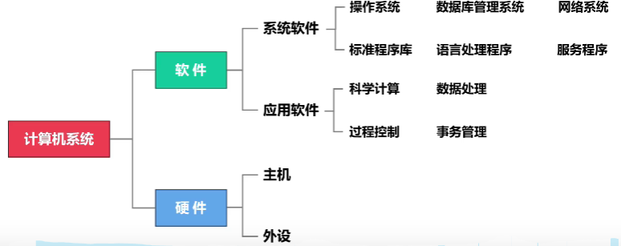

[toc]

# 计算机组成原理

## **第一章 计算机系统概述：**

### 1.计算机系统的组成：

常见的软件分类有：

1. 系统软件：操作系统、数据库管理系统DBMS、标准程序库、网络软件系统、语言处理程序
2. 服务性程序、编译程序、连接程序、分布式软件系统
3. 应用软件：微信、QQ、数据库软件DBS

- 一般来说，软件的功能和硬件的功能是可以相互替代的，硬件效率高，实现复杂，软件简单但效率低

### 2.计算机系统的发展：

### 3.计算机硬件组成：

上图为冯诺伊曼结构：以**运算器为中心（运算器负载高，压力大）**

特点：①计算机硬件系统由五大部件组成
	 ②**指令和数据都是以同等地位存于存储器，可按地址寻访，指令是顺序执行的**
	③指令和数据用二进制表示
	④指令由操作码和地址码组成 
	⑤**采用"存储程序"的工作方式**

冯氏结构的设计主要是以一种**控制流驱动的工作方式**进行的，即我给你把步骤安排好了，只需要按照这个控制流程走下去就行。

现代计算机则优化了这一结构，以存储器为中心

功能简介：

- ALU:用于算数运算和逻辑运算
- 主存储器：与cpu直接交换信息（交换信息有媒介的，不要搞混了 **内存—>cache—>寄存器**）
- 外部设备：输入输出设备，将输入内容转化为计算机所知道的，同时输出时将二进制转化为人所知道的。

### 4.计算机软件：

注意数据库这种特殊的系统软件，以及编译器，解释器这种用于程序翻译的系统软件。

程序在系统中被转化的流程：

整个过程经过了：

1. 预处理：将c文件中的一些注释等其他东西进行删除，同时进行宏替换，把一些头文件内容复制进来等一系列操作。
2. 编译：将c语言转化为汇编语言（**根据ISA架构转化为相应的汇编内容**，arm转arm的汇编，x86转x86的汇编）
3. 汇编：将汇编语言转换为机器可执行的二进制代码
4. 链接：将多个二进制代码模块串起来，形成一个完整的可执行文件。

详细的程序内存分配以及地址映射见程序装载部分（OS)

### 5.计算机系统的结构层次

**分层原因：**计算机是一个非常复杂的系统，为了**简化对计算机系统的研究和实现**，可以采用分层思想将计算机划分成多个层次的系统。

同计算机网络分层效果，**下一层为上一层提供一个简洁抽象的接口，屏蔽了内部实现过程。是透明的。**

各大分层都没有明确规定，这里给出了一个分层参考方案：

注意这里的考题，容易问你，哪类程序员在哪一层（也就是他应该知道哪一层的内容，而对其他层的内容不了解），**在 CPU 的寄存器中，指令寄存器对用户是完全透明的** 。

### 6.计算机的工作原理

接上文的内容，我们这次来详细讲讲各个硬件的详细组成：

#### 1.运算器:

1. 构成：ALU ，ACC(累加寄存器)， MQ乘商寄存器,  X操作数寄存器， PSW状态寄存器，移位器、计数器、变址寄存器IX、基址寄存器BR （后面这几个到寻址部分再来讲述）

   算术逻辑单元ALU：
   通过内部复杂的电路实现**算数运算、逻辑运算**

   累加寄存器ACC：
   用于**存放操作数，或运算结果**

   乘商寄存器MQ：
   在乘、除运算时 ，用于存放操作数或运算结果

   操作数寄存器X：
   用于存放操作数 

   **状态寄存器PSW：**
   存放ALU运算得到的一些标志信息或处理机的状态信息，OF, ZF ,SF, CF

以图表的形式展示如下：

#### 2.控制器：

1. 构成：CU、IR、PC、指令译码器(地址译码器在内存中)、时序系统、微操作信号发生器(后面几个涉及到数据寻址以及cpu构成的时候再来讨论)

2. 工作原理：

   控制单元 CU：分析指令，给出控制信号 

   指令寄存器 IR：存放当前执行的指令 **(IR中的内容来源于主存的MDR)**

   程序计数器 PC：存放下一条指令地址，有**自动加一**功能**（PC与主存的MAR之间有一 条直接通路）**

3. 注意事项：

   CPU 区分指令和数据的依据：1.指令周期的不同阶段（**在取指令阶段取出的为指令、在 执行指令阶段取出的即为数据**）2.通过地址来源区分 （**由PC提供存储单元地址取出的是指令、由指令地址码部分提供存储单元地址取出的是操作数**）

#### 3.存储器：

1. 构成：存储体、MAR,MDR（现代计算机为了加速计算，将这俩都放在cpu中）

2. 工作原理：存放二进制信息。 

   存储单元——每个存储单元存放一串二进制代码   存储字——存储单元中二进制代码的组合

    存储字长——存储单元中二进制代码的位数

    存储元——存储二进制的电子元件，每个存储元可存1bit MAR ： 存放访存地址，经过地址译码后找到所选的存储单元。 MAR位数反应存储单元的个数 【 MAR=4 位 ——> 总共有 24 个存储单元】 MDR ： 用于暂存要从存储器中读或写的信息。 =16bit 】 MDR位数=存储字长 【 MDR=16 位 ——> 每个存储单元可存放 16bit ，一个字 一个字节 =8bit ， 1B= 一个字节， 1b=1bit ，字由计算机硬件决定 。 时序控制逻辑：用于产生存储器操作所需的各种时序信号。

#### 4.工作过程：

7

### 7.计算机性能指标：

#### 1.机器字长：

字长：CPU内部用于整数运算的数据通路的宽度。（字长=CPU内部用于整数运算的运算 器位数=通用寄存器宽度） 

字：表示被处理信息的单位。不同机器的字的位数可能不同。 

机器字长：**计算机进行一次整数运算所能处理的二进制的位数**。 

指令字长：一个指令中二进制的位数 

存储字长：存储单元中二进制的位数(MDR)。指令字长一般为存储字长的整数倍。

#### 2.数据通路带宽：

hint: 这里的带宽是指的外部数据总线的宽度。而不是cpu内部总线的

数据通路带宽——**数据总线一次所能并行传送信息的位数**。

#### 3.主存容量：

$容量 = 存储单元个数 * 存储字长 （bit） = 存储单元个数 * 存储字长 / 8 （Byte）$

e. g   $MAR为32位，MDR为8位，总容量=232 * 8bit = 4GB$

#### 4.运算速度：

##### 1.吞吐量：

系统在单位时间内处理请求的数量，主要取决于主存的存取周期

##### 2.响应时间：

与操作系统中介绍的响应时间类似，**用户发出请求时间，到该请求被处理完的等待时间**

##### 3.cpu时钟周期：

每个脉冲信号的时间称为CPU时钟周期。**CPU工作的最小时间单位。**

##### 4.CPI:

定义：**执行一条指令所需要的时钟周期数量**。

注意一条指令的cpi和一类指令的cpi。一个通过测试得到，另一个是要加权平均的。

##### 5.cpu执行时间：

是cpu真正用于执行用户程序的执行时间。

定义为  $ cpu执行时间 = 程序执行所需要的时钟周期数量 * 时钟周期$

通常这里容易结合cpi来考，可参考下面例题。

##### 6.IPC

每个时钟周期能够执行的指令数量。

由定义可知，cpi的倒数就是ipc，由于现在的流水线技术的发展，现在的ipc值已经可以大于1了。

##### 7.MIPS

每秒执行多少百万条指令。

比较方式有点不准确，因为有些机器的架构和指令集设置不同，导致每台机器处理指令的速度不同。

##### 8.MFLOPS

每秒执行多少百万次浮点运算。

能够反映浮点计算能力，但是不能反映整体性能。

tip：注意这里的单位换算。

**在描述文件大小、存储容量的时候，K、M、G、T通常认为是2的次方** 

**在描述速率、频率的时候，K、M、G、T通常认为是10的次方**

### 8.几个专业术语

系列机：具有**基本相同的体系结构**，使用相同基本指令系统的多个不同型号的计算机组 成的一个产品系列。 

兼容：指软件或硬件的通用性，即运行在某个型号的计算机系统中的硬件/软件也能应 用于另一个型号的计算机系统时，称这两台计算机在硬件或软件上存在兼容性。 

软件可移植性：把使用在某个系列计算机中的软件直接或进行很少的修改就能运行在另 一个系列计算机中的可能性。 

固件：将程序固化在ROM中组成的部件。（**固件是具有软件特性的硬件，例如bios**）（执行速度 快于软件、灵活性快于硬件）

## **第二章 ： 数据的表示**

### 1.进制转换

基数： 每个数码位所用到的不同符号的个数，r进制的基数为r 。

二进制转十进制：101.1——>1 * 22 + 0 * 21 + 1*21 + 1 * 2-1 = 5.5 

八进制转十进制：5.4——>5 * 80 + 4 * 8-1 = 5.5 

十六进制转十进制：5.8——> 5 * 160 + 8 * 16-1 = 5.5

**方法：整数部分直接除以基数取余，最后将余数结果倒着排列一遍，小数部分就直接乘以基数，如果得到的结果中，出现了整数部分为1，那么就写1，同时直接将整数位变为0，这样依次进行下去，直到结果为0，或者达到一定精度。**

### 2.定点数的编码表示

#### 1.真值和机器数

- 真值：符合人类习惯的数字，计算机所代表的实际值。 
- 机器数：数字实际存到机器里的形式，正负号需要被“数字化”。

#### 2.机器数的定点表示

对于数据来说，有两种形式，一种整数，一种是小数。那么计算机来如何保存呢？

整数就用定点整数表示就好了，像小数，我们可以将其变成（定点整数+阶码），以浮点数的形式表示。

   定点表示法用来表示定点小数和定点整数。 

（1）定点小数：**定点小数是纯小数，即无整数部分**。小数点位置在符号位之后，最高有 效位之前。 

（2）定点整数：**定点整数是纯整数。小数点位置在最后**。

### 3.原码，补码，移码，反码表示法：

#### 1.介绍：

 **原码**：由符号位和数值位组成，正数：  符号位为0：负数  符号位为1。   

 优点：①与真值对应关系简单、直观 ，**在计算机中只用于表示浮点数的尾码**  ②原码乘除运算简单  缺点：①0的表示不唯一 ②原码加减运算复杂

**反码：**由符号位和数值位构成，正数，符号位为0 ，且数值位为原码数值位，负数的符号位为1 ，且数值位为原码数值位取反。

一般来说用的比较少。

**补码：**

直接讲求法了（反转法）：若为正数，则和原码表示一样，若为负数，符号位为1，数值位按位取反，最后在末尾加1，注意特殊情况 (10000000,只为8位的时候，这个数为 -128，小数为 -1 ）

**移码：**

求法：就把相应的补码的符号位取个反就是了。移码多用于表示阶码（整数）

#### 2.相互转换：

扫描法：原码转换为补码的时候可以采用 符号位其他位按位取反，然后在末尾进行加1

反码法：先将原码转换为反码，然后再转换为相应的补码。

### 3.浮点数表示

#### 1.引言：

计算机中主要有两种保存方式，一种为纯小数（也就是定点小数）表示法，一种为整数表示（即定点整数），那么我们如果保存小数，则需要将其化为定点小数和定点整数的集合（类似科学计数法）

为了计算机处理浮点数方便，我们规定：

#### 2.浮点数的表示范围：

浮点数的真值： $N = (-1)^s * r^E * M$ **(基数越大、范围越大、 但精度变低)**

对应的，如果想求其范围，一般来说，取阶码和尾数的最大最小值即可。

注意，一旦取到发生上溢，计算机会将该数置为 **无穷大或无穷小**，**发生下溢直接将数置为0**

#### 3.浮点数的规格化

类似科学计数法，我们总不可能想出现$0.1*10^3$这种数字出来, 这个数的理论表示应该为$1.0*10^2$

这里我们举个例子，以阶码为移码表示，尾数为原码表示。

规格化的好处：

- 使浮点数的表示形式唯一
- 使浮点数的表示精度最高

如何操作，采用左规和右归就好了，这两个操作主要是根据尾数来的

注意：右规的时候，可能会导致阶码**上溢**，左规的时候可能会导致阶码**下溢**。同时右规可能会导致浮点数的舍入。

主要是让最高位首位为有效位，即为1，如果遇到补码形式的尾数，**其规格化后一定为1.0或0.1(第一个数为符号位)。**  如果遇到不熟悉的尾数，转化为原码的再来研究就好了，原码的数值位第一位一定为1。

e.g:

附：

#### 4.IEEE 754浮点数

定义：直接背吧，没什么好的 ，分32位和64位的😭

**注意这里的隐藏的1，这个隐藏的1是不写出来的！！！！！！**，而且偏置常数为127

表示范围：

注意这个表格挖坑的地方：

- 正0和负0都是阶码和尾数都为0，看清楚了！
- 阶码的取值 $1<=E<=254$, 一旦不属于这个范围，那就要注意了！
- 为非规格化数时，记得隐藏位的1没有了 为0.x开头
- 注意无穷大和NaN的区别**（尾数）**

e.g:

e.g:

### 4.移位：

一般来说，左移能够使数字扩大到原来的二倍，右移能使数字缩小为原来的$\frac{1}{2}$，溢出判断见上面的讲解。

#### 1.逻辑移位：

**针对对象** ：无符号数

**规则： 左移：高位移出，低位补0  右移 ： 低位移出，高位补0**

一般用于寄存器快速置数或者快速清0

#### 2.算数移位：

**针对对象：**有符号数

**规则：** 两种方法，一是带着符号位玩的，二是不带符号位玩的

**不带符号位的：**

注意这里的溢出判断。是按照以前的最高位和现在的最高位进行比较得来的

**带符号位的移动：**

左移：高位移除，低位补0，移动前后符号位发生变化，则发生溢出

右移：低位移出，高位补符号位。

这种方法采用的比较多，cpu也是按照这种方式处理的

#### 3.循环移位：

**不带CF标志位的移动：**

举个例子：只是$x_0 -x_7$移动，不过每次移出的数字都要记录在CF中，CF中的数不参与移位

左移的方式类似

**带CF标志位的移动：**

移动方式就把CF算进移动数组，然后整体移动就行了

### 5.C语言中的数据类型转换：

#### 1.常见的关键字规定

老生常谈的东西了

| 类型      | 字长 | 表示形式 |
| --------- | ---- | -------- |
| float     | 4B   | IEEE 32  |
| short     | 2B   | 补码     |
| char      | 1B   | 补码     |
| int       | 4B   | 补码     |
| long      | 4B   | 补码     |
| long long | 8B   | 补码     |
| double    | 8B   | IEEE 64  |

double能够完美表示float

注意这里的unsigned 前缀 ，**unsigned一般用原码表示** 

一般来说，如果超出字段长度了，机器会将机器码的高位截断，而将低位保留。

而低字长转为高字长的部分，无符号数就进行**0拓展**，有符号数就进行**符号拓展**

相同字长的转换，保证机器码不变就行了

举个例子：

这里的short是无符号数，直接0拓展就好了

#### 2.整形向浮点型的转换

## **第三章   数据的运算：**

### 1.补码的加法减法（定点数的加法减法）：

**1.运算方式：**

和平常的计算的方式一样，没啥特殊的。**该运算方式也可推广到两个无符号数的计算**
$$
[A_补]+[B_补]=[{A+B}_补]
\\
[A_补]-[B_补]=[{A-B}_补]=[A_补]+[-B_补]
$$
**2.溢出判断：**

由于计算机字长有限，故在计算时，超出表示范围的就导致溢出了。（这里建议回归机器码的数据的表示范围）

**方法1：**根据**操作数的符号位**和**运算结果的符号位**是否一致来判断，符号位相同，则不溢出，符号位不同，则溢出

一般来说，补码的加减法溢出的情况，都是**同号数相加才会溢出**

下面给一个例子展示：

**方法2：**根据运算过程的**最高位数值位**的**进位于符号位**的进位一起判断

溢出判断公式为$C_F\oplus C_H$ ，若为1，则发生溢出。

不能判断哪种类型的溢出

**方法3：**双符号位，增加了一个符号位：

**方法4：采用一位符号位，直接进行判断：**

附：一位全加器电路图：

注意如何学会判断门电路的延迟

串行加法器的电路图如图所示：

检测方法采用的讲述的第二种方法$C_F\oplus C_H$ ，

当sub=0 ，做加法，y不用取反，然后参与加法运算， sub=1时，做减法，求出 -y的补码，然后进行相加（sub线这里相当于$C_0$,提供了加1操作）

快速加法器(先行进位加法器)，降低了门延迟，提高了计算速度

### 2.无符号数的乘法（主要考察电路）：

基本思想：采用加法加上移位操作。例如每次乘完后将结果先右移一位，然后再继续乘接下来的数

例子：在正式进行乘法之前，**ACC置0**，**每次根据乘商寄存器MQ的低位，来判断是否要加上X.** $C_n$控制这种操作有多少次，例如这里有4位小数，那么$C_n$就为4，每次计算后，都要进行移位

整个执行过程如下图所示：

### 3.无符号数的阵列乘法器（了解即可）

**引入：**

如果在计算的时候，我们能把每一个部分积给求出来，那么就可以进行快速的乘法运算，得到最后的结果。

类比超前进位加法器，可以设计以下电路：

FA为全加器，实现两个数的乘法用与门进行。

由于每次进位加减法都是由几个全加器串联形成（类似串行进位加法器），每次要做$O(N)$次的加法，如果可以将这种串行进位方式优化为超前进位的方法，可以大幅度减少时间。

相应的，华莱士结构（CSA）型可以减少时间，将每次加法的时间缩短到$O(log_2n)$

###  4.原码的乘法计算方式

原码比无符号数多了一个符号位，因此可以将符号位和数值位分开进行处理：

符号位异或一下就好了，数值位仍然借用无符号数的电路进行计算

整个计算流程如下：

其中的$C_{out}$是进位信号， $C_n$是计算次数

### 5.补码的乘法计算（了解即可）:

一般来说采用布斯算法，前面的推导过程省略。

乘数的最低位一般要加一位辅助位0，

根据$Y_i与Y_{i+1}的值来判断$

| $Y_iY_{i+1}$ | 操作                |      |
| ------------ | ------------------- | ---- |
| 00或11       | 部分积 +0           |      |
| 01           | 部分积 +$x[补]$     |      |
| 10           | 部分积 +$[-x_{补}]$ |      |

算法例子见课本66 页

流程：这里的例子是两个长度相等的补码。

1. 乘数最低位加上辅助位 $Y_i=0$
2. 根据上面表格，确定是用哪一个操作
3. 每次操作后，都要将部分积右移一位。
4. 重复上述过程n次，即可得到结果

这里可以看见，电路设计时，需要译码器进行三项选择来进行操作，电路的计算速度是能够得到保障的

题目出现了补码的计算，转换为原码的计算，然后再转回补码看是否溢出就好了

### 6.补码阵列乘法器

电路图过于复杂了，讲讲设计思路就好了，主要转换为无符号数的乘法方式

同理，处理方式和之前一样，符号位单独提出来处理，数值位变成无符号数。

符号位两者异或，数值位先将补码转换为原码，然后再进行计算。（负数按位取反，末尾加1）

上面的加法器求补电路也可适用于求补码到原码

下图为大致思路

### 7.原码除法运算（恢复余数法）：

后面的处理基本上都以这个假设为主： 

**被除数X为2n位，除数和商都为n位，后续的无符号数和定点小数除法也是一样的规定**

基于这个假设，同理，这里也有条规定：

定点小数：
$$
|x|<|y|\\|被除数|<|除数|
$$
定点整数：
$$
|x|>|y|\\|被除数|>=|除数|
$$
这两种方式可以防止计算时出现溢出。

笔算流程如下：

逻辑电路处理方式如下：

1. 符号位分开处理，将数值位单独拧出来。
2. 求出数值位的补码表示形式     $[|x|]_补,[|y|]_补,[-|y|]_补$
3. 初始化时，**先将乘商寄存器MQ置为全0，除数放在寄存器X中，ACC先存入被除数，作为初始余数**。
4. 然后余数R依次加上$[-|y|]_补$,判断中间余数是否为负数，如果是则商0，恢复余数后进行移位，如果不是则商1。
5. 依次迭代，最后得到结果。
6. 注意最后的符号位

整个过程**需要求补电路的参与**

一个例子如下：

### 8.原码除法运算（不恢复余数法）：

1.引入：

在上一节中，由于每次商0后，需要将余数恢复到原来的数字，故降低了运算速度，可以采用不恢复余数的方法进行设计。该种算法在设计电路时应用很多。

按照上一节的例子，推导过程如下：

如此，可以得到以下结果：

举个例子：

这节建议回归链接[原码除法计算](https://www.bilibili.com/video/BV1qG41197E4?spm_id_from=333.788.videopod.episodes&vd_source=694ebbaf16fcc9737e88f9462c59617d&p=37)

电路的设计可以转化在原来的加减法电路上加上一些控制逻辑，然后进行计算。

### 9.补码除法运算（两种方法，有点冷门）

看看视频：[link](https://www.bilibili.com/video/BV1qG41197E4?spm_id_from=333.788.videopod.episodes&vd_source=694ebbaf16fcc9737e88f9462c59617d&p=38)

加减交替法 

1. 符号位参与运算 被除数/余数、除数采用双符号位
2.  被除数和除数同号，则被除数减去除数; 异号则被除数加上除数。 
3. 余数和除数同号，商1，余数左移一位减去除数; 余数和除数异号，商0，余数左移一位加上除数。 重复n次

### 10.浮点数加减法运算：

按照四个步骤：

1. 对阶，小的阶码向大的阶码看齐。求出两个阶码的绝对值之差）

2. 尾数运算

3. 结果进行规格化，主要是将尾数进行规格化（hint:回忆各种数据表示方法，对应的规格化数为多少），这里可能出现阶码溢出的情况，阶码上溢，或者阶码下溢。

4. 进行最后的舍入处理

   >

举个例子：

 

### 11.IEEE 754浮点数运算，浮点数乘除运算：

这里简单过一下思想就行。

具体可参考视频[link](https://www.bilibili.com/video/BV1qG41197E4?spm_id_from=333.788.player.switch&vd_source=694ebbaf16fcc9737e88f9462c59617d&p=42)

### 12. 运算器：

之前在[ALU结构](#1.运算器)简单提到了一些组成部分，现在我们来进行详解：

运算器分为一下两种：

1. 定点运算器，以算数逻辑单元ALU为核心，可以进行定点数的移位，算术，逻辑运算等操作
2. 浮点运算器，以浮点计算单元FPU为核心，负责进行浮点数的运算。

易知，浮点数的运算比较，相应的浮点运算器的结构更为复杂。

ALU的结构如下（一位计算的ALU)：

和前面的串行进位加法器一样，如果把多个1位ALU串起来，那么就有了：

**进位标志：**

CF标志位主要用于无符号数的运算，OF标志位主要用于有符号数的运算，这几个标志位都存放在程序状态字寄存器PSW中。ZF对所有的数都起作用。SF符号位寄存器，对有符号数有作用。

OF判断标志：hint:回忆前面溢出是怎么判断的。[溢出判断方式](#1.补码的加法减法（定点数的加法减法）：)

OF常用判断溢出的方法为： 根据运算过程的**最高位数值位**的**进位于符号位**的进位一起判断

溢出判断公式为$OF=C_F\oplus C_H$ ，若为1，则发生溢出。

CF判断溢出的标志：$CF=Sub\oplus C_{out}$  ，$C_{out}$是指的进位输出

## **第四章 存储器：**

### 1.存储器概述：

**1.存储器的分类：**

一些概念的解释：

1. 随机存储器是指能够**按地址访问的存储器**，类似数组能够通过下标访问。
2. 相联存储器是按照内容访问的存储器。
3. **只读存储器，不一定是只能支持内容读入，在一定条件下，可以支持重新写入。**
4. 易失性存储器与非易失性存储器都在断电情况下，数据都会丢失。
5. 多级结构是为了解决计算机各个部分处理数据速度不匹配的问题设计的。一旦速度跟上了，可以减少多级设计。

### 2.存储器指标分析：

**1.容量指标：** **存储容量 = 存储字长 x 存储单元数量**

**2.速度指标：**

>**1.存取时间**：启动一次存储器到该操作完成所经历的时间，分为读入时间和读出时间，一般来说是相等的，也有例外，例如闪存（flash) ，读快写慢。
>
>2.存取周期：**连续两次访问存储器的操作之间所需要的最短时间间隔**。  对于主存，存取周期包括存取时间外，还包括存储器状态的稳定恢复时间，因此，存取周期大于存储时间。
>
>
>
>3.带宽DB，单位时间内每次能传输多少个二进制信息数量。

**3.结构层次：**

### 3.主存基本结构：

主存是机器指令的直接操作的存储器，需要**基于主存地址对其进行随机访问**

一般来说，主存由MAR（地址寄存器），MDR（数据寄存器）等寄存器，以及存储体构成，控制电路构成。现代的计算机将MAR和MDR集成到cpu中了。

#### 单译码结构：

只运用一部分地址线进行译码操作（类比1维数组）

#### 双译码结构：

两个维度进行译码（按键扫描，类别二维数组），减少了地址线的同时，又减少了数据线，适用于大容量存储器。

### 4.主存数据的存放：

#### 1.机器字长与存储字长：

机器字长：CPU一次能够处理的二进制数据的位数

存储字长：主存中的一个存储单元所能存储的二进制位数

#### 2.地址访问模式：

1.字节地址   2. 半字地址   3. 字地址

一般来说，计算机按照字节编址的，寻址大小根据计算机的位数，例如32位和64位

#### 3.大端模式和小端模式：

大端模式，低地址存放数值高位，高地址存放数值低位。 MIPS ，ARM

小端模式，低地址存放低位，高地址存放高位。这样可以将主存地址的高低与数据的位权进行结合，符合处理逻辑，x86 , IA64 RISC-V ，ARM

#### 4.边界对齐：

高级语言中的不同数据类型所包含的字节数量不同，当一个**多字节变量被编译器分布在不同的存储单元时，访问该变量需要多个周期**，为了减少访问时间，可以采用空间换时间的技术，即采用对齐技术。

如何对齐：

方法1：

方法2：

另一个规则：

>1.起始地址%该成员的长度=0
>
>2.结构体的长度也必须是最大成员长度的整数倍。

### 5.SRAM:

#### 1.SRAM简介：

简介：SRAM是随机存取存储器RAM的一种，其**不需要进行周期性的刷新操作**，只能存放一个二进制位，由6个mos管组成。大致结构如下：

特性：

- 上电后的初始状态随机
- 读操作不会破坏原有数据
- 造价较为昂贵，常用于Cache

#### 2.SRAM的拓展：

字拓展：

由上面的电路图可知，对于行选通和列选通，我们都可以将周围的mos管进行复用，注意了这个存储器中每次只能有一个存储元可以工作。这样的拓展仅仅拓展了字数，没有拓展位数。

位拓展：

将上面组成的芯片进行并联（地址线复用，可以实现位拓展）

#### 3.SRAM实例：

将上面讲述的电路图加上一些控制电路，即可形成一个大容量存储器：

注意$\overline{WE}和\overline{CS}这两个信号$，很容易在设计时漏掉

SRAM的地址线与DRAM不同，其地址线不能复用。

### 4.DRAM:

#### 1.DRAM结构：

由电路可知，电容C充满电后（也就是二进制1的时候），仍然会出现漏电现象（MOS管不是完全断开的），因此**DRAM需要刷新**。而且读出数据这个操作，是一个放电过程，因此，对于读完数据后，需要对DRAM进行恢复。

**1.读操作：**

先进行充电操作，然后进行访问，进而进行信号检测，然后恢复数据，最后数据输出。

**2.写操作：**

与读操作类似，只不过最后是数据读入

#### 2.DRAM的刷新：

刷新周期：DRAM实际完成**两次完整刷新**之间的时间间隔。

最大刷新周期：从**数据存入DRAM开始，到数据丢失前为止的这段时间**，称为**最大刷新周期**

刷新存储元的数量：**DRAM按照行进行刷新，**为了缩短刷新周期，可以**减少存储阵列的行数**

hint:**刷新操作只需要给出行地址**，不需要给出列地址

三种刷新方式：

##### 1.集中刷新：

一个刷新周期中，选取一段时间对整个芯片进行刷新

e.g：

优点：空白时间内访问主存的速度较快。

缺点：死区时间较长。

##### 2.分散刷新：

相当于重新定义了新的存取周期，存取周期加上一个刷新时间构成新的存取周期

##### 3.异步刷新：

前两种刷新方式的结合：相当于将刷新周期按DRAM行数均分，然后每个周期末尾对DRAM的每一行进行刷新：

#### 3.DRAM的拓展：

$\overline{RAS} $:

- **作用：** 这条线用于**启动行地址操作**。当它有效（通常是变低）时，DRAM会去读取地址线 ($A_0 \sim A_6$) 上的行地址信息。

**$\overline{CAS}$ (列地址选通) 线路:**

- **作用：** 这条线用于**启动列地址操作**。当它有效（通常是变低，在$\overline{RAS}$之后）时，DRAM会去读取地址线 ($A_0\sim A_6$) 上的列地址信息，并且这条线也用于**控制数据的实际读出或写入动作的触发**。

**$D_{in}$ **

- **作用：** 在进行**写操作**时，要存入DRAM的数据通过这条线路输入。

**$D_{out}$  **

- **作用：** 在进行**读操作**时，从DRAM中读取的数据通过这条线路输出。

注意这里的$A_0 \sim A_6$地址线是复用的。还有多出来的三条信号线$\overline{RAS} $ ,$\overline{CAS}$ , $\overline {WE}$

e.g:

### 5.ROM：

**1.定义**:只能从其中读出信息，而**不能随意写入信息的存储器**叫ROM

**2.分类：**

MROM: 特点只能读出，不能修改。

PROM: 用户只能进行一次改写。

EPROM: 可多次写入，不过要通过紫外线照射后进行擦除重写。

EEPROM: 运用电擦除方式进行擦除，可以精准**擦除某一个存储元**

flash: 删除是以块为单位擦写(先擦后写，因此读快写满)，更适合大量存储

### 6.主存的拓展：

#### 1.位拓展：

主要是针对于**数据总线位宽小于CPU总线位宽**的情况，直接将数据位宽拓展就好了。

注意这里的使能信号与R/W以及片选信号。

#### 2.字拓展：

主要是针对存储器的存储容量不够的情况。

注意这里的$A_{18} \sim A_{20}$ 作为高地址，用作片选信号。低18位作为内部芯片信号。

各个存储芯片的片选引脚$\overline{CS}$可以由CPU多余地址引脚通过译码器产生。

#### 3.字位同时拓展：

#### 4.部分练习：

注意这里的$000000H \sim 3FFFFFH$，如何转换为RAM的大小？**hint:相减加1**

### 7.主存的速度优化：

提升主存的速度方法有：

- 使用高速元件。
- $利用并行工作 \begin{cases} 双端口存储器 \\ 单体多字存储 \\ 多体交叉存储\end{cases}$

